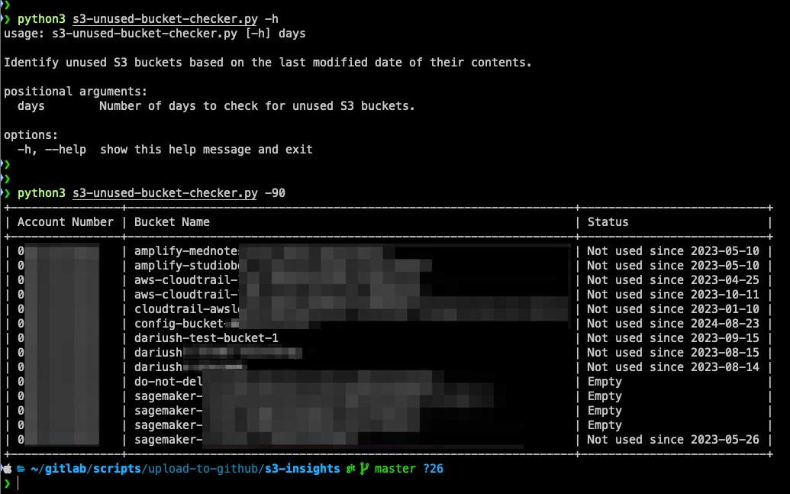

# S3 Unused Bucket Checker

## Overview
This Python script helps identify unused or empty S3 buckets by checking the last modified date of objects within each bucket. The user provides a specific number of days as input, and the script lists buckets that haven't been accessed within that time period, along with empty buckets.

## Key Features
- **Reports on Unused and Empty Buckets**: The script checks the last modified date of objects in each bucket to determine whether the bucket is unused or empty.
- **Customizable Timeframe**: The user can specify the number of days to check for inactivity.
- **Table Output**: The results are displayed in a neatly formatted table with columns for AWS Account Number, Bucket Name, and Status.

## Key Changes
- **Threading for Parallel Execution**: The script now uses `ThreadPoolExecutor` to check the status of multiple S3 buckets concurrently, significantly improving performance.
- **Modular Design**: The bucket status check has been moved into its own function, enabling efficient parallel processing.

## Benefits
- **Faster Execution**: Parallel processing of bucket status checks improves performance, especially for accounts with a large number of buckets.
- **Scalability**: The script is better suited for large-scale environments, making it faster and more efficient.
- **Clear and Structured Output**: The use of `PrettyTable` ensures that results are easy to read and interpret.

## Requirements
- Python 3.x
- Boto3
- PrettyTable

Install the necessary dependencies using:

```bash
pip install boto3 prettytable
```

### Usage
Ensure your AWS credentials are properly configured.
Run the script with the number of days as an argument:

```
python s3-unused-bucket-checker.py  <number_of_days>
```
For example, to check for buckets that haven't been used in the last 90 days:

```
python s3-unused-bucket-checker.py 90
```
## Example Output

